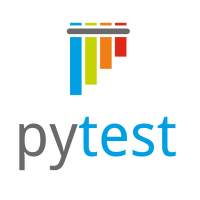
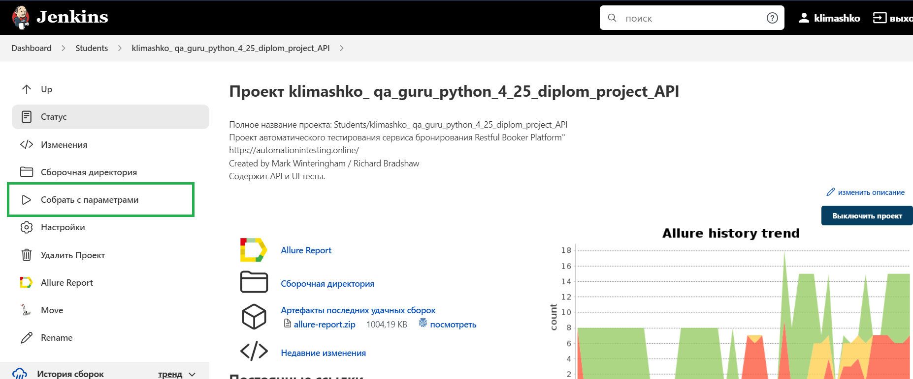
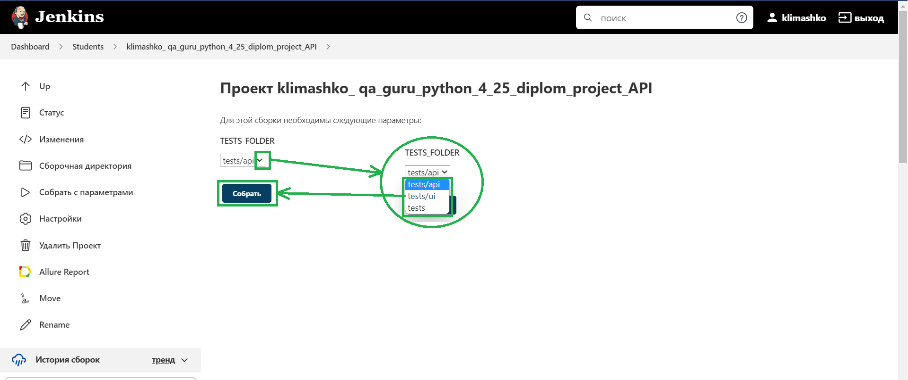
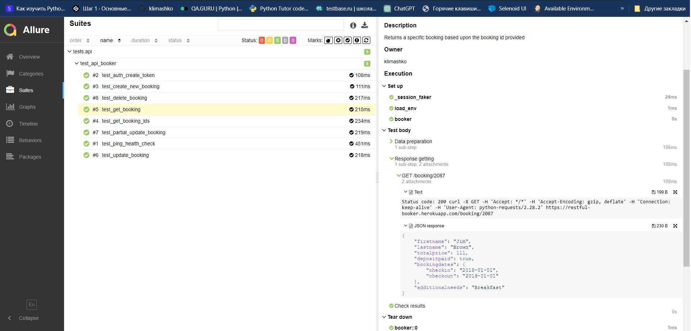
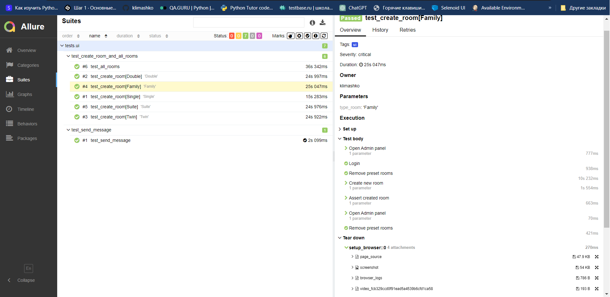
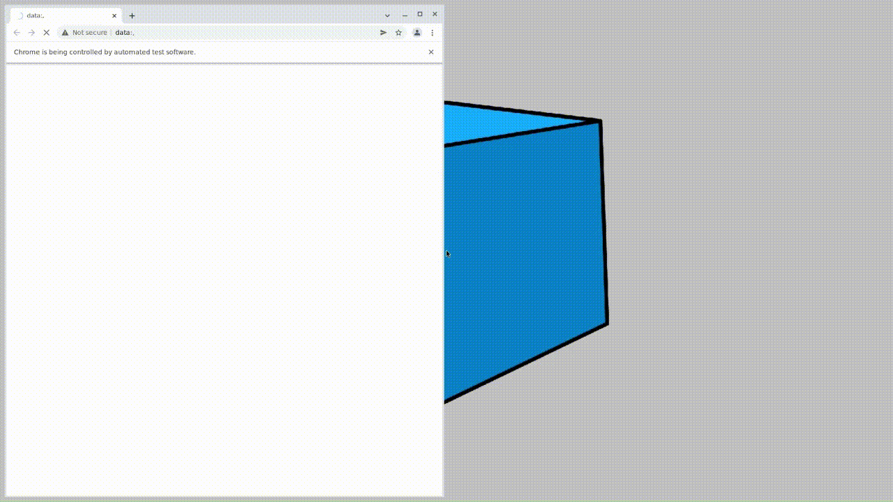
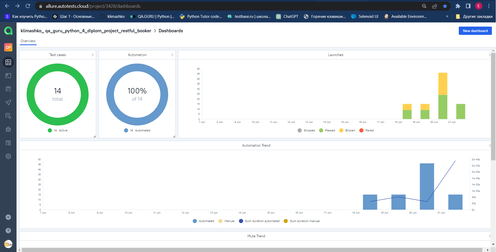
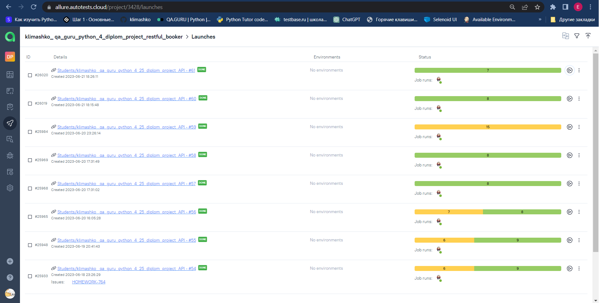
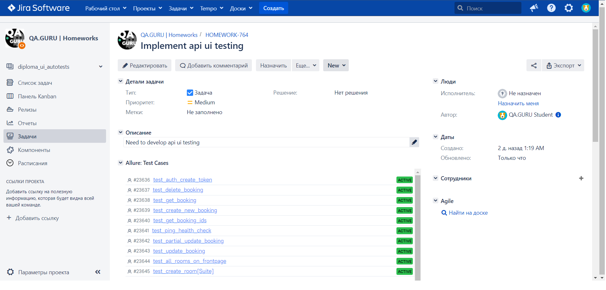
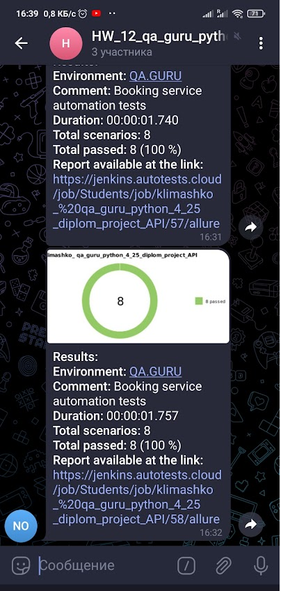

## Описание

<p>В проекте реализована API и UI автоматизации тестирования на Python.
<p>При написании тестов применялись инструменты ООП, а также использовался шаблон 
<p>проектирования PageObjects.
<p>Подключена система отчетности Allure Reports с вложениями (логи, скриншоты, видео). 
<p>В тестах шаги размечены с помощью allure.step.
<p>Браузер в UI-тестах запускается удаленно в Selenoid.
<p>Реализованы интеграции с Allure TestOps и Jira.
<p>Уведомление о прохождения теста отправляется в Telegram.

# Проект автоматического тестирования сервиса бронирования гостиничных номеров Restful Booker Platform"

#### Created by Mark Winteringham / Richard Bradshaw

> <a target="_blank" href="https://automationintesting.online/">Restful Booker
> Platform</a>
>
> <a target="_blank" href="http://restful-booker.herokuapp.com/apidoc/index.html">API
> документация</a>

## Проверяется функционал сервиса:

#### API автотесты

- [x] Проверка работоспособности, чтобы убедиться, что API запущен и работает.
- [x] Создание нового токена авторизации для доступа к обновлению или удалению
  бронирования.
- [x] Создание нового бронирования в API.
- [x] Возврат id всех бронирований, существующих в API.
- [x] Возврат конкретного бронирования.
- [x] Обновление бронирования.
- [x] Частичное обновление бронирования.
- [x] Удаление бронирования.

#### UI  автотесты

- [x] Отправка пользователем сообщения на главной странице сервиса.
- [x] Создание админом всех видов гостинничных номеров, отображение на главной
  странице.
- [x] Создание админом гостинничного номера, отображение на главной странице.

## Особенности тестов

Тест test_create_room параметризован, создается каждый вид гостиничного номера.

## Используемые технологии

Python, PyCharm, Pytest, Selen, Jenkins, Selenoid, Allure Report, Allure TestOps, Jira,
Telegram, GitHub.
<p>
  <code></code>
  <code></code>
  <code></code>
  <code></code>
  <code></code>
  <code></code>
  <code></code>
  <code></code>
  <code></code>
  <code></code>
</p>


## Локальный запуск автотестов

Запуск api тестов:

```bash
pytest tests/api
```

Запуск ui тестов:

```bash
pytest tests/ui
```

Получение отчёта:

```bash
allure serve allure-results
```


## Запуск автотестов c помощью [job в Jenkins](https://jenkins.autotests.cloud/job/Students/job/klimashko_%20qa_guru_python_4_25_diplom_project_API_UI/)

## Нажать "Собрать с параметрами"




## Указать какие тесты будут запущены, нажать кнопку Собрать




## Посмотреть выполнение прогона

### Ссылка 1 на скриншоте для Allure Report, ссылка 2 для Allure_TestOps.


## Отчет прохождения API тестов



[Сборка с прохождением API suites](https://jenkins.autotests.cloud/job/Students/job/klimashko_%20qa_guru_python_4_25_diplom_project_API_UI/66/allure/)


## Отчет прохождения UI тестов



[Сборка с прохождением UI suites](https://jenkins.autotests.cloud/job/Students/job/klimashko_%20qa_guru_python_4_25_diplom_project_API_UI/61/allure/)


## Пример видео о прохождении UI теста




## Результаты выполнения тестов интегрированы с Allure TestOps

## Dashboard_Allure_TestOps




## Launches_Allure_TestOps



[Проект в Allure_TestOps](https://allure.autotests.cloud/project/3428/dashboards)


## Отчеты Allure TestOps интегрированы с Atlassian Jira



[Задача в Jira](https://jira.autotests.cloud/browse/HOMEWORK-764)


## Настроено автоматическое уведомление о результатах сборки Jenkins в Telegram-бот

[Telegram-бот](https://t.me/+Ctoxu_5DqE1hNDEy)

<p>
  <code></code>
</p>
